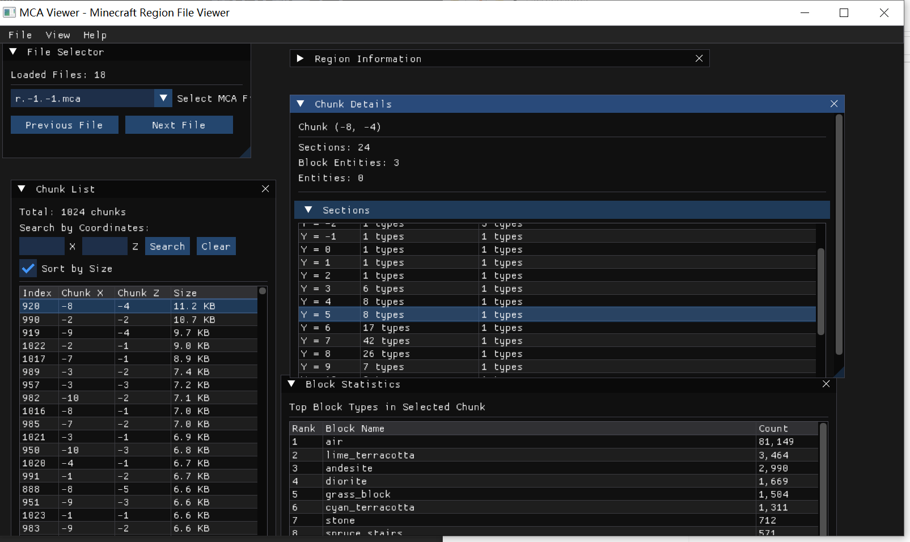
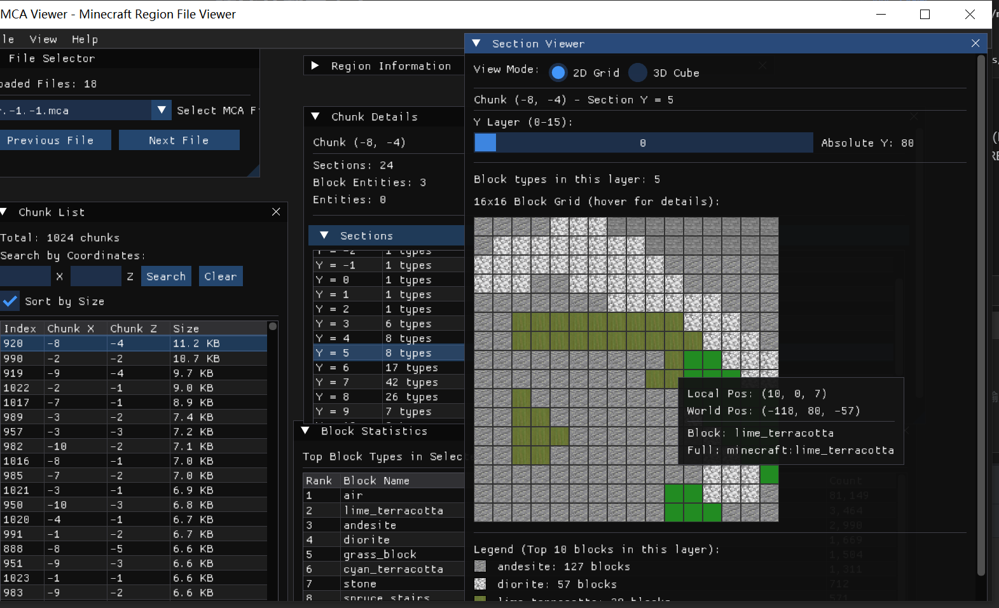
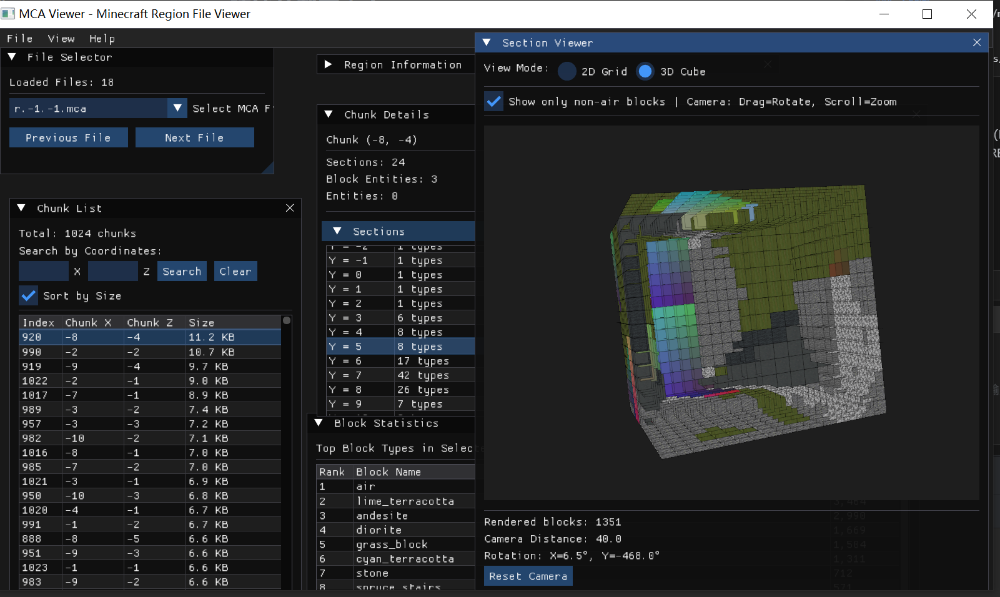

# ChunkMapTool - Minecraft Region File Viewer

一个用 C++ 编写的 Minecraft Region 文件可视化查看工具，能够完整解析并可视化展示地图文件的所有数据。

## 📸 界面预览

### 主界面

*完整的 GUI 界面，包含 Region Info、Chunk List、Chunk Details 和 Block Statistics 面板*

### 2D 网格视图

*Section Viewer 的 2D 模式，以网格形式展示 16x16 方块，每个方块显示对应纹理*

### 3D 立方体视图

*Section Viewer 的 3D 模式，完整渲染 16x16x16 立方体，支持交互式旋转和缩放*

---

## 功能特性

### 核心解析功能
- ✅ 完整的 MCA 文件格式支持
- ✅ NBT (Named Binary Tag) 格式解析（支持所有 13 种标签类型）
- ✅ Paletted Container 解码（可变位宽索引解包）
- ✅ 支持 GZip 和 Zlib 压缩格式
- ✅ 方块状态和生物群系数据提取
- ✅ 方块实体和实体数据提取
- ✅ **版本兼容性**：
  - **新版本**（Minecraft 1.13+）：完整支持，方块名称直接存储在 NBT 数据中
  - **旧版本**（Minecraft 1.2 - 1.12.2）：支持，通过 Block ID 映射到方块名称
    - ⚠️ 映射表存储在 `ids.json` 中，包含常用方块（不完全覆盖所有方块）
    - 未映射的方块会显示为 `minecraft:legacy_block_{id}_{data}` 格式
- ✅ 跨平台支持（Windows、Linux、macOS）

### GUI 可视化功能
- ✅ 图形化界面（基于 Dear ImGui + OpenGL）
- ✅ Region 和 Chunk 信息展示
- ✅ Section Viewer - 2D 网格视图
- ✅ **Section Viewer - 3D 立方体视图**
  - 完整的 3D 方块渲染
  - 纹理映射（支持所有六个面）
  - 交互式相机控制（旋转、缩放）
  - 性能优化（完全包裹剔除）
  - ⚠️ **纹理说明**：
    - 纹理文件存储在 `texture/` 目录
    - 当前提供的纹理仅供参考，不保证完全覆盖所有方块
    - 缺失纹理的方块会显示为默认颜色
    - 用户可自行添加更多纹理文件（PNG 格式，命名为方块名称）
- ✅ 方块统计和分析
- ✅ 实时数据查看

## 项目结构

```
ChunkMapTool/
├── CMakeLists.txt              # CMake 构建配置
├── include/                    # 头文件
│   ├── Core/
│   │   ├── DataStructures.h    # 核心数据结构定义
│   │   ├── McaFileLoader.h     # MCA 文件加载器
│   │   ├── NbtParser.h         # NBT 解析器
│   │   └── ChunkDecoder.h      # Chunk 解码器
│   └── Utils/
│       ├── Compression.h       # 压缩/解压工具
│       └── Logger.h            # 日志系统
├── src/                        # 源文件
│   ├── Core/
│   │   ├── McaFileLoader.cpp
│   │   ├── NbtParser.cpp
│   │   └── ChunkDecoder.cpp
│   ├── Utils/
│   │   └── Compression.cpp
│   └── main.cpp                # 主程序
└── README.md                   # 本文件
```

## 依赖项

- **C++17** 或更高版本
- **CMake 3.15** 或更高版本
- **zlib** 库（用于压缩/解压）

### 安装依赖

#### Windows (使用 vcpkg)
```bash
vcpkg install zlib:x64-windows
```

#### Linux (Ubuntu/Debian)
```bash
sudo apt-get install zlib1g-dev
```

#### macOS (使用 Homebrew)
```bash
brew install zlib
```

## 编译

### 使用 CMake

```bash
# 创建构建目录
mkdir build
cd build

# 配置项目（需要指定 vcpkg toolchain）
cmake .. -DCMAKE_TOOLCHAIN_FILE=[vcpkg root]/scripts/buildsystems/vcpkg.cmake

# 编译
cmake --build . --config Release

# 可执行文件位于 build/bin/Release/mcatool.exe
```

### Windows (Visual Studio)

```bash
# 生成 Visual Studio 解决方案
cmake -G "Visual Studio 17 2022" -A x64 ..

# 使用 Visual Studio 打开生成的 .sln 文件，或使用命令行编译
cmake --build . --config Release
```

## 使用方法

### 启动程序

**Windows**：
```bash
# 方式 1：直接双击运行
双击 mcatool.exe

# 方式 2：从命令行启动
cd ChunkMapTool_Release
.\chunkmaptool.exe
```

**Linux/macOS**：
```bash
cd ChunkMapTool_Release
./chunkmaptool
```

### 使用流程

1. **加载地图文件**
   - 点击 `File -> Open Test Cases` 加载测试文件
   - 或点击 `File -> Open MCA Folder...` 选择自己的 Minecraft 存档

2. **浏览 Chunk 数据**
   - 在左侧 `Chunk List` 中选择要查看的 Chunk
   - 右侧 `Chunk Details` 会显示该 Chunk 的详细信息

3. **查看 Section 视图**
   - 在 `Chunk Details` 中点击 Section 行
   - `Section Viewer` 窗口会自动打开

4. **切换视图模式**
   - 点击 `2D Grid` 查看 2D 网格视图
   - 点击 `3D Cube` 查看 3D 立方体视图

5. **3D 视图操作**
   - 🖱️ 鼠标左键拖拽：旋转视角
   - 🖱️ 鼠标滚轮：缩放距离
   - ☑️ 勾选 "Only show non-air blocks"：隐藏空气方块
   - 🔄 点击 "Reset Camera"：重置相机位置

## 核心组件说明

### 1. McaFileLoader
负责加载 MCA 文件，解析 8KB 的 Header（Location Table + Timestamp Table），提取所有 Chunk 数据。

### 2. NbtParser
解析 NBT 二进制格式，支持所有 13 种标签类型：
- TAG_End, TAG_Byte, TAG_Short, TAG_Int, TAG_Long
- TAG_Float, TAG_Double, TAG_String
- TAG_Byte_Array, TAG_Int_Array, TAG_Long_Array
- TAG_List, TAG_Compound

### 3. ChunkDecoder
将 Chunk 数据解码为可读的方块数据：
1. 解压 NBT 数据（GZip/Zlib）
2. 解析 NBT 结构
3. 转换为 PalettedChunk
4. 解码 Paletted Container（可变位宽索引解包）
5. 生成 DecodedChunk（包含完整的方块名称数组）

### 4. Compression
提供 GZip 和 Zlib 压缩/解压功能，使用 zlib 库实现。

## 版本兼容性说明

### 新版本格式（Minecraft 1.13+）
- **存储方式**：方块名称直接存储在 NBT 数据的 Palette 中
- **优点**：无需额外映射，直接读取即可获得完整的方块名称
- **示例**：`minecraft:stone`, `minecraft:oak_log[axis=y]`

### 旧版本格式（Minecraft 1.2 - 1.12.2）
- **存储方式**：使用 Block ID（数字）+ Block Data（4位）存储方块
- **映射机制**：通过 `ids.json` 文件将 Block ID 映射到方块名称
- **映射表说明**：
  - 包含 **常用方块** 的映射（如 stone, dirt, grass_block 等）
  - **不完全覆盖** 所有方块（部分罕见方块可能缺失）
  - 未映射的方块显示为 `minecraft:legacy_block_{blockId}_{blockData}` 格式
- **示例映射**：
  ```json
  {
    "1": "minecraft:stone",
    "1:1": "minecraft:granite",
    "2": "minecraft:grass_block",
    "3": "minecraft:dirt"
  }
  ```

### 纹理支持说明
- **纹理位置**：`texture/` 目录
- **文件格式**：PNG 格式，命名为方块名称（如 `stone.png`）
- **覆盖范围**：当前提供的纹理 **仅供参考**，不保证完全覆盖所有方块
- **缺失处理**：缺失纹理的方块会显示为默认颜色方块
- **自定义纹理**：用户可自行添加更多纹理文件到 `texture/` 目录

## 技术细节

### MCA 文件格式

```
MCA 文件结构:
├── Header (8KB)
│   ├── Location Table (4KB) - 1024 个条目，每个 4 字节
│   └── Timestamp Table (4KB) - 1024 个条目，每个 4 字节
└── Chunk Data (变长)
    └── 每个 Chunk:
        ├── Length (4 bytes)
        ├── Compression Type (1 byte)
        └── Compressed NBT Data
```

### Paletted Container 解码

Minecraft 使用 Paletted Container 压缩存储方块数据：

1. **调色板（Palette）**: 存储该 Section 中实际使用的方块类型
2. **索引数据（Data）**: 使用可变位宽存储每个方块在调色板中的索引
3. **位宽计算**: `bits_per_block = max(4, ceil(log2(palette_size)))`
4. **数据打包**: 多个索引打包到 64 位 long 整数中

本项目实现了完整的跨 long 边界的位操作处理。

## 已完成功能

- [x] 核心 MCA 解析功能
- [x] NBT 完整支持
- [x] Paletted Container 解码
- [x] 旧版本格式支持（1.2 - 1.12.2）
- [x] GUI 界面（Dear ImGui）
- [x] **3D 可视化渲染**
  - [x] 3D 立方体视图
  - [x] 纹理映射
  - [x] 相机控制系统
  - [x] 性能优化
- [x] 方块统计分析
- [x] 实时数据查看


## 许可证

MIT License

## 参考资源

- [Minecraft Wiki - Region file format](https://minecraft.wiki/w/Region_file_format)
- [Minecraft Wiki - Chunk format](https://minecraft.wiki/w/Chunk_format)
- [NBT Format Specification](https://minecraft.wiki/w/NBT_format)

## 贡献

欢迎提交 Issue 和 Pull Request！
